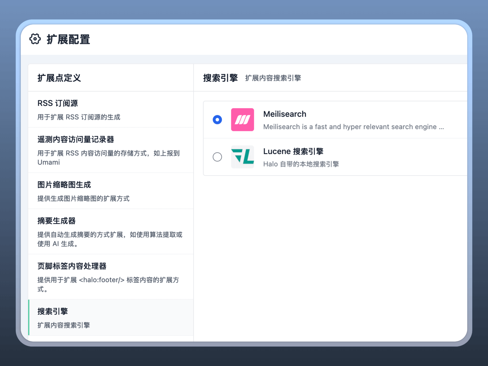

## Meilisearch 插件

这是一个适用于 [Halo](https://github.com/halo-dev/halo) 的 Meilisearch 插件，支持将 Halo 的搜索功能与 Meilisearch 集成，提供更快速、更准确的搜索体验。


## 使用方式

### 搭建 Meilisearch 服务

获取一个服务通常有两种方式，你可以选择自行在云服务器上托管，或者使用 Meilisearch 官方提供的云服务。

#### 云服务

访问 <https://www.meilisearch.com/cloud> 注册账号，根据引导创建一个项目即可。最后可以在控制台获取实例地址和 Master Key。

#### 自托管

这里介绍两种部署方式：

1. 使用 Docker Compose 独立编排部署：

   > 这种方式适合多个项目需要同时使用一个 Meilisearch 服务的场景。
   > 部署完成之后，你可以解析一个域名以暴露在公网。

   ```yaml
   services:
     meilisearch:
       image: getmeili/meilisearch:v1.15
       restart: unless-stopped
       ports:
         - "7700:7700"
       environment:
         - MEILI_ENV=production
         - MEILI_MASTER_KEY=<your-super-secret-master-key-here>
       volumes:
         - meilisearch_data:/meili_data

   volumes:
     meilisearch_data:
       driver: local
   ```

2. 与 Halo 的 Compose 编排一起部署：

   > 结合 [使用 Docker Compose 部署 Halo](https://docs.halo.run/getting-started/install/docker-compose) 的示例，将 Meilisearch 服务添加到 `docker-compose.yml` 文件中。

   > 通过这种方式部署之后，插件设置中的 **Meilisearch 服务地址** 应该是 `http://meilisearch:7700`

    ```yaml
      meilisearch:
        image: getmeili/meilisearch:v1.15
        restart: on-failure:3
        networks:
          - halo_network
        volumes:
          - ./meilisearch-data:/meili_data
        environment:
          - MEILI_ENV=production
          - MEILI_MASTER_KEY=<your-super-secret-master-key-here>
    ```

    <details>
      <summary>点击查看完整示例</summary>

      ```yaml
      version: "3"

      services:
        halo:
          image: registry.fit2cloud.com/halo/halo:2.21
          restart: on-failure:3
          depends_on:
            halodb:
              condition: service_healthy
          networks:
            halo_network:
          volumes:
            - ./halo2:/root/.halo2
          ports:
            - "8090:8090"
          healthcheck:
            test: ["CMD", "curl", "-f", "http://localhost:8090/actuator/health/readiness"]
            interval: 30s
            timeout: 5s
            retries: 5
            start_period: 30s
          environment:
            - JVM_OPTS=-Xmx256m -Xms256m
          command:
            - --spring.r2dbc.url=r2dbc:pool:postgresql://halodb/halo
            - --spring.r2dbc.username=halo
            - --spring.r2dbc.password=openpostgresql
            - --spring.sql.init.platform=postgresql
            - --halo.external-url=http://localhost:8090/
        halodb:
          image: postgres:15.4
          restart: on-failure:3
          networks:
            halo_network:
          volumes:
            - ./db:/var/lib/postgresql/data
          healthcheck:
            test: [ "CMD", "pg_isready" ]
            interval: 10s
            timeout: 5s
            retries: 5
          environment:
            - POSTGRES_PASSWORD=openpostgresql
            - POSTGRES_USER=halo
            - POSTGRES_DB=halo
            - PGUSER=halo
        meilisearch:
          image: getmeili/meilisearch:v1.15
          restart: on-failure:3
          networks:
            - halo_network
          volumes:
            - ./meilisearch-data:/meili_data
          environment:
            - MEILI_ENV=production
            - MEILI_MASTER_KEY=<your-super-secret-master-key-here>

      networks:
        halo_network:
      ```

    </details>

详细的部署方式可以参考 Meilisearch 官方文档：<https://www.meilisearch.com/docs/learn/self_hosted/install_meilisearch_locally>

### 安装插件

1. 下载，目前提供以下两个下载方式：
    - Halo 应用市场：<https://www.halo.run/store/apps/app-7mb5szjt>
    - GitHub Releases：访问 [Releases](https://github.com/halo-sigs/plugin-meilisearch/releases) 下载 Assets 中的 JAR 文件。
2. 安装，插件安装和更新方式可参考：<https://docs.halo.run/user-guide/plugins>

### 配置插件

1. 进入插件设置，配置 **Meilisearch 服务地址** 和 **Master Key**。

    

2. 进入插件扩展配置，在 **扩展点定义** 中选择 **搜索引擎**，然后选择使用 Meilisearch 即可。

    

## 常见问题

1. 正确配置之后无法在前台搜索到内容

   > 可以尝试在仪表盘页面的快捷访问中刷新搜索引擎。
